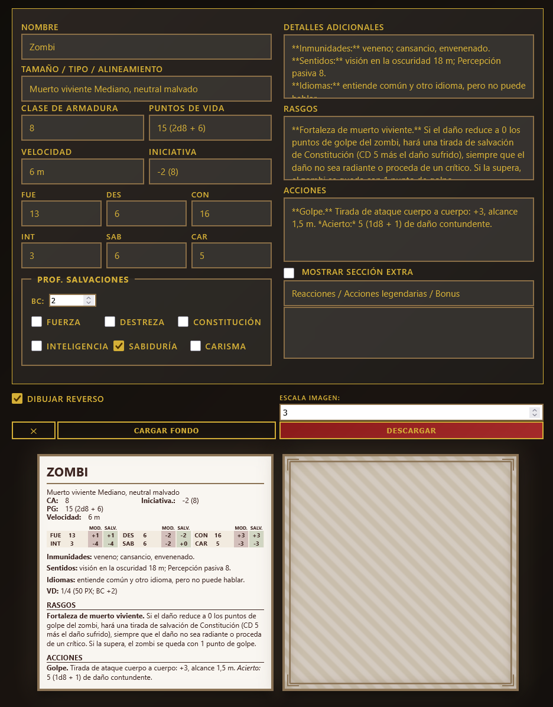

# 🐉 Generador de Tarjetas de Monstruos D&D 5.5e

App offline para crear y exportar tarjetas de monstruos para D&D 5.5e con estilo premium.

## 📋 Características

### Frente de la Tarjeta
- **Información básica**: Nombre, tipo/tamaño/alineamiento
- **Estadísticas de combate**: Clase de armadura, puntos de golpe, velocidad, iniciativa
- **Puntuaciones de habilidades**: FUE, DES, CON, INT, SAB, CAR con modificadores
- **Salvaciones**: Cálculo automático con bonificador de competencia
- **Detalles**: Inmunidades, sentidos, idiomas, valor de desafío
- **Rasgos**: Habilidades especiales y características
- **Acciones**: Ataques y acciones de combate
- **Sección extra**: Reacciones, acciones legendarias o bonuses (opcional)

### Reverso de la Tarjeta (Bonus)
- Patrón de barras diagonales marrones cuando no hay fondo
- Soporte para imagen de fondo del enemigo
- Sincronización automática de tamaño con el frente
- Marco decorativo elegante estilo D&D

### Exportación
- **Descarga PNG**: Genera imágenes de alta calidad (configurar escala 1x a 3x+)
- **Dual export**: Descarga frente y reverso por separado si está activo
- **Nombre automático**: Basado en el nombre del monstruo con timestamp

## 🎨 Diseño

- **Tema premium**: Colores marrón oscuro y oro (#d4af37) estilo D&D oficial
- **Sin animaciones**: UI rápida y responsiva
- **Markdown support**: Formatea texto con **negrita**, *cursiva* y encabezados
- **Modal editor**: Fullscreen textarea para editar campos largos cómodamente
- **Responsive**: Funciona en navegadores de escritorio y móviles

## 🚀 Cómo Usar

1. **Rellenar formulario**: Completa los datos del monstruo en el panel izquierdo
2. **Previsualizar**: Ve los cambios en tiempo real en la tarjeta
3. **Cargar fondo**: (Opcional) Sube una imagen para el reverso o frente
4. **Activar reverso**: Marca "Dibujar reverso" para mostrar el dorso de la carta
5. **Exportar**: Haz click en "Descargar" para guardar como PNG

### Atajos
- **Click en textareas**: Abre editor modal fullscreen
- **Escala imagen**: Ajusta resolución de exportación (3 = 300% de calidad)
- **✕ / Cargar fondo**: Botones unidos para gestionar imagen de fondo

## 📱 Compatibilidad

- ✅ Navegadores modernos (Chrome, Firefox, Edge, Safari)
- ✅ Offline: No requiere conexión a internet
- ✅ HTML5 puro: Sin dependencias externas (solo html2canvas para PNG)

## 🎮 Ejemplo de Uso

Crear una tarjeta de "Dragón Rojo Adulto":
1. Nombre: `Dragón Rojo Adulto`
2. Tipo: `Dragón Enorme, caótico malvado`
3. CA: `19` | PG: `256 (19d20+95)`
4. Rasgos: `**Legendario.** El dragón puede realizar...`
5. Acciones: `**Ataque de aliento.** El dragón exhala fuego...`
6. Cargar imagen del dragón rojo como reverso
7. Exportar como PNG de alta calidad

## 💡 Tips

- **Formato markdown**: Usa `**texto**` para negrita, `*texto*` para cursiva
- **Salvaciones**: Marca solo las habilidades con bonificador especial
- **Sección extra**: Actívala solo si necesitas reacciones o acciones legendarias
- **Escala**: Para imprimir, usa escala 2-3 (más detalle pero archivo más grande)

## 🔧 Tecnología

- **Frontend**: HTML5 + CSS3 + Vanilla JavaScript
- **Exportación**: [html2canvas](https://html2canvas.hertzen.com/) v1.4.1
- **Idioma**: Español (100% interfaz en español)

## 📄 Licencia

Proyecto personal para facilitar la creación de contenido de D&D 5.5e.

---

**¿Preguntas o sugerencias?** Este es un proyecto en desarrollo. ¡Siéntete libre de adaptar y mejorar!
